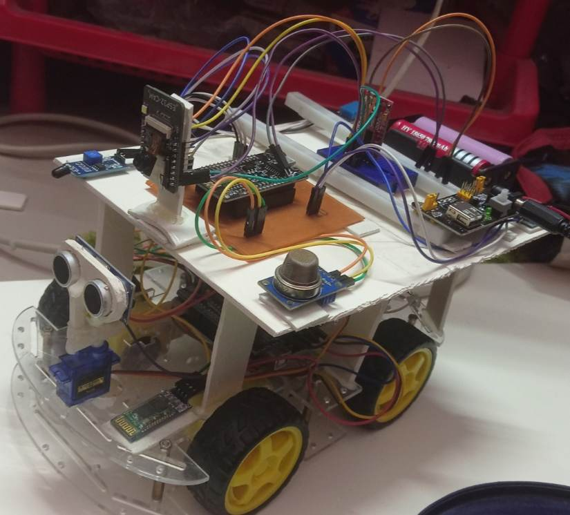

# IoT-Based Mine Security and Surveillance Robot

### 🚀 Overview
The rapid growth of mining activities has highlighted the need for cutting-edge security and surveillance solutions to ensure worker safety and protect valuable assets. Our **IoT-Based Mine Security and Surveillance Robot** leverages advanced IoT technology, sensors, and real-time monitoring to detect potential hazards and mitigate risks in mining environments. This innovative solution provides round-the-clock surveillance, environmental monitoring, and remote-controlled operations, keeping mines safer, smarter, and more efficient.

### 🌐 What It Does
This robot combines a range of sensors, cameras, and IoT algorithms to constantly monitor the mine's environment. Equipped with **NodeMCU** as the brain of the operation, it communicates real-time data to the **Blynk platform** for live monitoring and alert notifications. The robot also features a **remote-controlled robot car** powered by **Arduino UNO** and a **driver shield**. This car houses the entire sensor and camera setup, allowing it to navigate hazardous areas and small, confined spaces to provide surveillance and safety checks, even in dangerous or hard-to-reach zones.

### 🔑 Key Features:
- **Gas Sensors**: Detects dangerous gases or leaks, providing life-saving alerts.
- **Temperature & Fire Sensors**: Monitors for high temperatures and fire breakouts to ensure worker safety.
- **ESP32 CAM**: Provides real-time video surveillance of the entire area, ensuring constant visibility.
- **Humidity Sensors**: Tracks environmental conditions to ensure mine safety.
- **Voice and Remote-Controlled Robot Car**: The robot car can be remotely controlled to navigate hazardous zones, even in tight spaces, for security purposes or to search for people during emergencies.
- **Blynk Notifications & Alerts**: If life-threatening conditions are detected, the **Blynk app** sends instant notifications and emails to the user, ensuring immediate action can be taken.
- **Custom PCB Design**: The robot's PCB is designed using **ExpressPCB** software, showcasing the intricate interconnection between sensors and **NodeMCU**, ensuring seamless operation.

The entire system can be remotely monitored and controlled through the **Blynk app** and **web dashboard**, offering real-time data on environmental conditions and enabling quick decision-making in case of emergencies.

### 🛠️ Technologies Used
- **NodeMCU**: Powers the entire IoT system and connects to the Blynk platform.
- **Arduino UNO + Motor Driver Shield**: Powers the robot car for remote-controlled mobility.
- **ESP32 CAM**: Provides live video footage for surveillance.
- **Blynk Platform**: Displays real-time data and sends alerts when thresholds are crossed.
- **Gas, Fire, Temperature, and Humidity Sensors**: Monitors environmental conditions and potential threats.
- **ExpressPCB Software**: Used to design the custom PCB that integrates all sensors and components.

### 🔧 How It Works
1. **Sensor Monitoring**: Continuously monitors environmental factors like gas leaks, fire, temperature, and humidity.
2. **Surveillance**: The robot’s camera system provides live video footage for real-time monitoring.
3. **Remote-Controlled Car**: The robot car, controlled via voice commands or remotely, explores dangerous zones or confined spaces, ensuring security and safety.
4. **Alerts & Notifications**: When thresholds are breached, the system triggers alerts in the Blynk app and sends email notifications for immediate action.
5. **Remote Monitoring**: Operators can monitor and control the system remotely using the Blynk app or web dashboard.

### 🛠️ Full Project Documentation
For detailed information about the project's design, coding, and outputs, check out the complete [Project Documentation](https://github.com/Miinhaz/IoT-Based-Mine-Security-and-Surveillance-Robot/blob/main/ETE_3200_Project.pdf).

### 📸 Visuals

#### 📬 Contact
For any questions or feedback, feel free to reach out through the project's GitHub Issues page.

--- 

**Stay Safe, Secure, and Smart with IoT-Powered Mining!**
